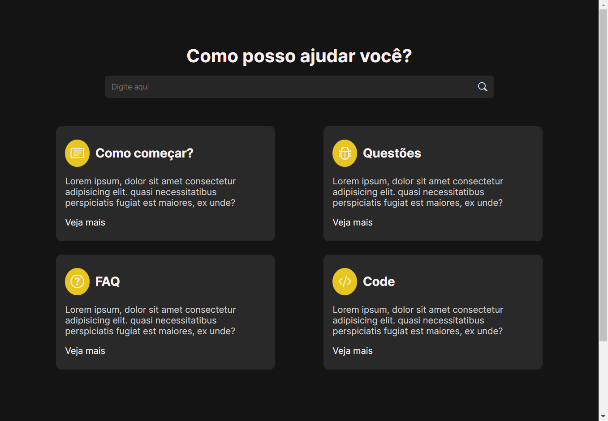
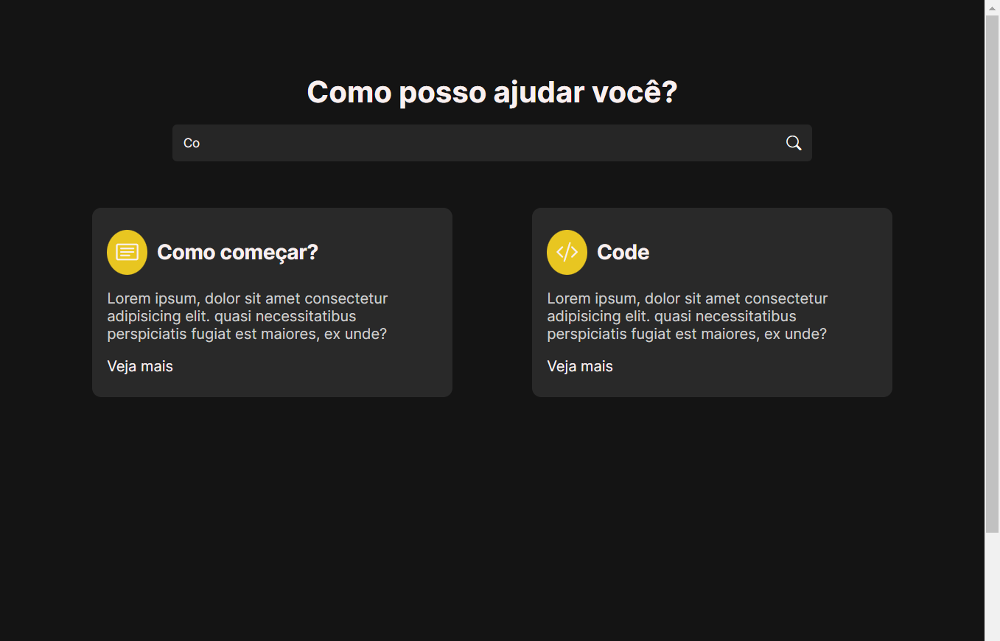

<h1 align="center"> Sistema de filtragem </h1>

  <a href="#-tecnologias">Tecnologias</a>&nbsp;&nbsp;&nbsp;|&nbsp;&nbsp;&nbsp;
  <a href="#-projeto">Projeto</a>&nbsp;&nbsp;&nbsp;|&nbsp;&nbsp;&nbsp;
  <a href="#memo-licença">Licença</a>

  

 

  
  

## 🚀 Tecnologias

Esse projeto foi desenvolvido com as seguintes tecnologias:

- HTML
- CSS
- Git 
- Github

## 💻 Projeto

Projeto criado com intuito de aprender a filtrar elementos da página através do conteúdo de um input, feito com JavaScript
Muito divertido e simples o projeto, com certeza vai útil em projetos futuros.

- [Acesse o projeto finalizado, online](https://system-filter.vercel.app/)

## :memo: Licença

Esse projeto está sob a licença MIT.
